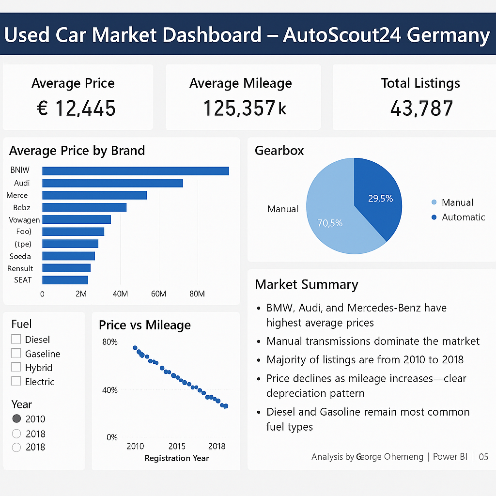

# 🚗 Used Car Market Dashboard – AutoScout24 Germany

This Power BI dashboard analyzes over **43,000 used car listings** from AutoScout24 Germany. The goal is to uncover key trends in **pricing**, **mileage**, **brand popularity**, **gearbox preference**, and **fuel type**. It's an excellent demonstration of how data analytics and visualization support business decisions in the automotive industry.

---

## 📊 Dashboard Preview

---

## 🔍 Key Insights

- **BMW, Audi, and Mercedes-Benz** have the highest average prices.
- **Manual transmissions** dominate the German used car market (70.5%).
- Majority of listings are from **2010 to 2018**, indicating strong resale volumes.
- **Depreciation Trend:** Price declines steadily as mileage increases.
- **Diesel and Gasoline** remain the most common fuel types.

---

## 🧠 Business Use Case

This dashboard can help:
- Car dealerships optimize pricing strategies.
- Buyers identify value-for-money brands.
- Analysts understand depreciation and fuel preferences.

---

## 📁 Files Included

| File                         | Description                                 |
|-----------------------------|---------------------------------------------|
| `dashboard.png`             | Power BI dashboard screenshot               |
| `autoscout24-cleaned-data.csv` | Cleaned dataset used for analysis        |
| `autoscout24-dashboard.pbix`   | Power BI project file                    |

---

## 🧰 Tools Used

- **Power BI** – For data visualization and dashboard creation  
- **Excel** – For initial data cleaning and transformation  
- **GitHub** – For project hosting and version control  

---

## 💼 Use Cases

This project is perfect for:
- Data analytics portfolios
- Business intelligence case studies
- Automotive market research
- Job interviews and project showcases

---

## 👤 Author

**George Ohemeng**  
GitHub: [Data-ctrl-del](https://github.com/Data-ctrl-del)  
📧 Email: georgeohe6@gmail.com  

---

## 🔗 Live Repository

[github.com/Data-ctrl-del/autoscout24-powerbi-dashboard]   https://data-ctrl-king.github.io/autoscout24-powerbi-dashboard

